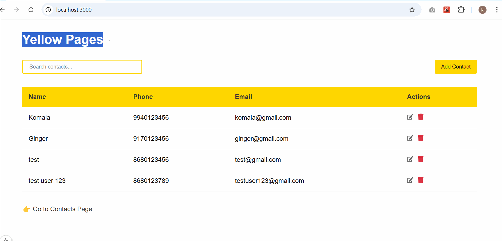

Do npm install, as packages like dotenv and nodemon are required.

# npm run dev for Front end

# npm start for Back end

Both the commands should be run from the root folder.

Data is stored in MongoDB.

Code base still needs optimization and bug fixes.

Sample Demo:

